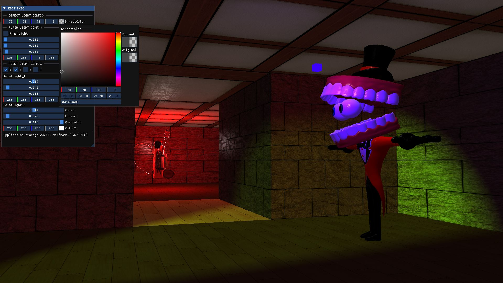
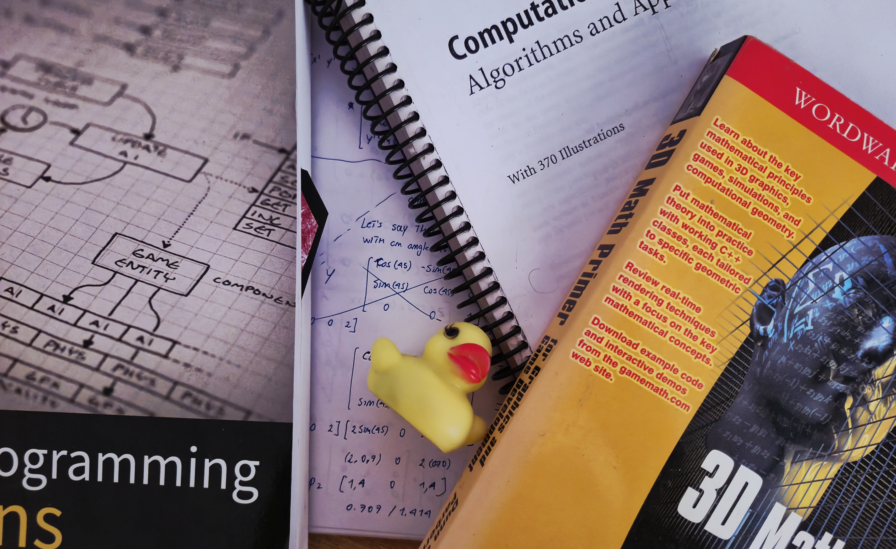

# DEMOGL

## What is this about?
On February 24, 2026, I started this project to dive into graphics programming, OpenGL, and game development. Honestly, I wasn't sure how far I would get, so I didn't document the early process. Now, I feel much more confident about how things are going.

As I mentioned, this repo started as a general learning space. I tried to turn it into a game engine, but things didn't go as planned and the whole codebase became a mess. Honestly, that was a good thing—it made me realize my lack of organization. Because of that, I’ve opened a new, dedicated repository to develop the engine, and this current repo will now serve as a base strictly for learning graphics and building demos.

---
## Building the Engine
Unfortunately, I don't have my original "hello triangle" to show. This screenshot is from much later, after I learned about multiple light management, loading Blender models, and integrating ImGui.

---
## Struggling with the Engine 
I tried to encapsulate a lot of features here, like a Scene class and a UI class. I had to get rid of the older models because my laptop couldn't handle too many vertices (I don't even have a dedicated graphics card). I also had fun learning about depth testing, as you can see, but this is exactly where the structural problems began.

---
### June 26, 2026 (Birth of DEMOGL)
I started feeling unsure about the project because I realized that, to make an engine, I probably should have made a simple game first. I didn't consider that at the beginning. When I finally wanted to develop a game, I realized I was drained of creativity and my code was incredibly messy. Trying to build a game on top of it would have been a nightmare.

(I'm speaking as a newbie here—I know an experienced programmer could probably take this and make a decent game without struggling as much as I did!)

That's why, after some thought, I finally decided this repository will just be about learning graphics and building demos. The actual game I want to make will live in a new, separate repository containing only the tools and code I strictly need.

to be continued... 
