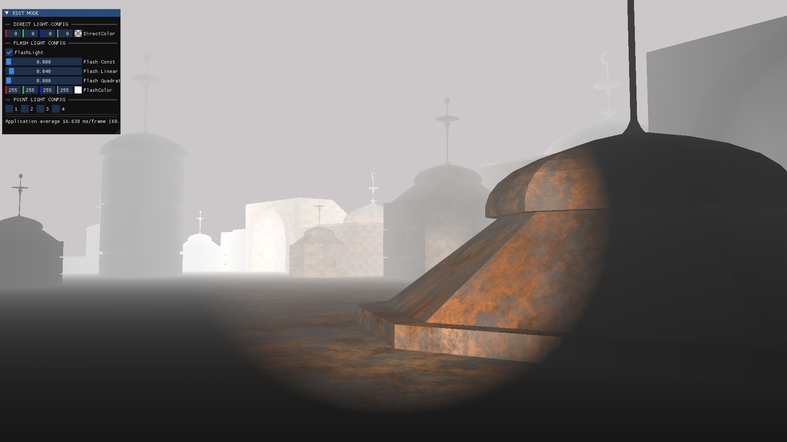

# DEMOGL

# What is this about?
---
In Feb 24, 2026 I started this project to start learning about graphics programming, OpenGL and game development... Honestly I wasn't sure about how far I could get so I didn't record the process but now I feel more secure about how things are going, this repo as I say, started as a general learning stuff, I tried to made it become a game engine but things didn't go as planed and the hole code base was a mess, a mess that made me realize my lack of organization, and thats a good thing to be honest, that's why I opened a new repo to develop the engine and this one now will serve as a base for only learning graphics and building demos.



```

--- 
## TODO
---
### NEED TO FIX
- REVIEW MODEL CALCULATIONS (NORMALS, VERTICES)
- FIX THE SPECULAR TEXTURES (HOW TO EXPORT SPECULAR BLEND)
- FIX THE MODEL LOADING .GBL
- DIFF CALCULATIONS IN THE FRAG SHADER (LIGHT COLOR MANAGEMENT)
- SCENE CLASS IS A JOKE... URGENT REFACTOR
- EDIT MODE NEEDS BIG REFACTOR
- REFACTOR THE KEY PRESS FOR THE FRAGMENT SHADER OUTPUT 
--- 
### NEED TO ADD

- PHYSICS ENGINE
- DYNAMIC OBJECT INSTANCE 
- DYNAMIC EDIT MODE
--- 
### DONE

- SET DEFINITIONS TO EDIT VALUES PARAMETERS (PARTIALLY DONE)
- CENTER MODELS?? (NORMALS PROBLEM) DONE* (PROBLEM IN INVERSE CALCULATIONS)
- CONTAINER NORMALS... ALWAYS NORMALS!!!
- SET COLORS FOR LIGHT SOURCES

